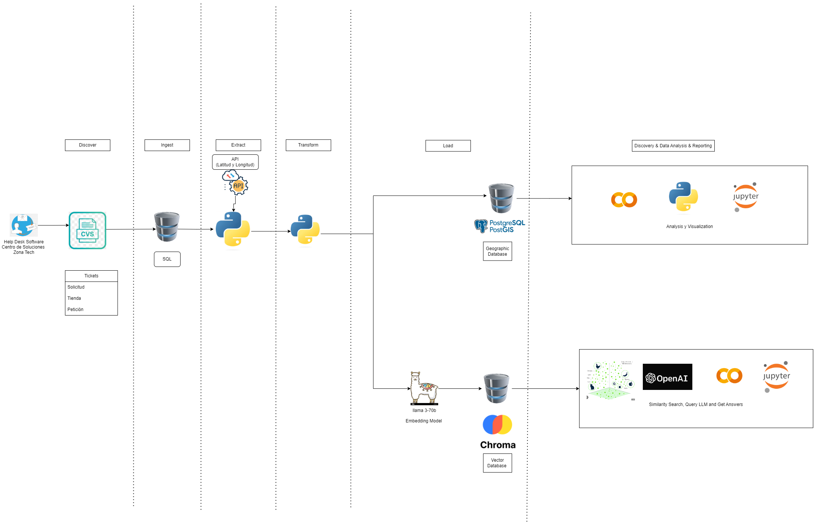

# Documentación del Proyecto
## Geobúsqueda sobre servicios de soporte de TI
---

## Introducción
- **Descripción del Proyecto:** El presente proyecto tiene como objetivo principal crear un buscador geográfico de incidentes atendidos por las diferentes mesas de soporte de TI de una importante cadena de *retail* a nivel latinoamericano. Dichas peticiones esta asociadas a la tienda en la cual se presenta la solicitud; las tiendas están georeferenciadas y se identifican los polígonos que mejor representan a las ciudades en las que la cadena de *retail* tiene presencia.

  Para lograr este objetivo, se utilizará **PostGIS** como motor de base de datos geográfica, creando tablas que contengan los polígonos de las ciudades donde se encuentran las tiendas.

  Adicionalmente, se empleará el motor de bases de datos vectoriales **Chroma** para procesar las descripciones de cada solicitud, identificando *embeddings* y patrones. Estos patrones serán posteriormente procesados con la ayuda de un modelo lingüistico avanzado (LLM), como **LLaMA** o **Chat-GPT**, con el fin de proporcionar respuestas estructuradas a las consultas de los usuarios.

  El *front-end* del sistema incluirá un cuadro de diálogo con dos campos: uno de texto para capturar la solicitud del usuario y un desplegable que mostrará un listado de las ciudades donde la cadena de *retail* tiene tiendas u oficinas.

  La secuencia de funcionamiento será la siguiente:

1. **Captura de Consulta**: El usuario ingresa su consulta en un campo de texto y selecciona la localización deseada de un desplegable.
2. **Filtrado Geográfico**: La consulta se captura en un array de tipo string y se filtran los tickets asociados a la localización especificada. En PostGIS, se realiza el filtrado de todos los tickets que están dentro del área cubierta por el polígono estructurado para la ciudad o ubicación seleccionada.
3. **Procesamiento de Tickets**: Los tickets ubicados en la zona geográfica seleccionada se envían a Chroma, donde se procesan los embeddings asociados a las palabras de la consulta del usuario para identificar los tickets más relevantes.
4. **Generación de Respuesta**: Los embeddings más relevantes se pasan al modelo de lenguaje de gran formato, que prepara una respuesta para el usuario. Esta respuesta incluirá un listado de tiendas con mayor frecuencia de solicitudes de soporte en el área seleccionada y una descripción de las solicitudes o fallas mencionadas por el usuario.

Lo anterior permite identificar las fallas más relevantes que se presentan en soporte de TI de la cadena de *retail* y hacer un uso eficiente de la información de los tickets generados para la optimización de recursos en respuesta a fallas de alta frecuencia en las zonas que desea analizar el usuario.
  
- **Contexto:** En los últimos años, la industria del retail ha experimentado un crecimiento significativo en América Latina, incrementando la complejidad y el volumen de las operaciones de soporte de TI. Las cadenas de retail dependen cada vez más de sistemas tecnológicos avanzados para gestionar sus operaciones diarias, desde la gestión de inventarios hasta la atención al cliente. Una importante cadena de retail latinoamericana ha identificado la necesidad de optimizar su servicio de soporte de TI para responder de manera más eficiente a los incidentes reportados en sus múltiples tiendas distribuidas por la región.

  Actualmente, las peticiones de soporte son manejadas por diferentes mesas de servicio, pero la falta de un sistema centralizado que permita visualizar geográficamente los incidentes y analizar patrones de solicitudes dificulta la identificación de problemas recurrentes y la asignación eficiente de recursos. Además, la cadena ha implementado diversas tecnologías innovadoras que requieren un soporte técnico continuo, tales como servicios de abastecimiento, sistemas de venta avanzados, dinámicas de descuentos, cajas autoatendidas y pagos en línea.

- **Alcance:** El proyecto va desde la configuración de la base de datos geográfica hasta la generación de la respuesta al usuario sobre la búsqueda/consulta planteada; para lograr esto, se implementarán las siguientes funcionalidades y tecnologías:

  **Base de Datos Geográfica**: Implementación de PostGIS para crear y gestionar una base de datos que contenga los polígonos de las ciudades donde la cadena de retail tiene presencia, permitiendo georreferenciar cada tienda.

  **Procesamiento de Descripciones de Solicitudes**: Utilización de Chroma para procesar las descripciones de las solicitudes de soporte, identificando patrones mediante embeddings y modelos lingüísticos avanzados como LLaMA o ChatGPT.

  **Interfaz de Usuario**: Desarrollo de una interfaz de usuario intuitiva que incluye un campo de texto para ingresar consultas y un desplegable para seleccionar la ubicación de interés.

  **Filtrado Geográfico de Incidentes**: Creación de un sistema que filtre las solicitudes de soporte en función de la ubicación seleccionada por el usuario, utilizando PostGIS para identificar los tickets dentro de los polígonos correspondientes.

  **Análisis y Respuesta Automatizada**: Integración de un modelo lingüístico que analice los embeddings más relevantes y genere respuestas estructuradas, proporcionando información sobre las tiendas con mayor frecuencia de incidentes y detalles de las solicitudes más comunes.

  A su vez, el proyecto espera lograr las siguientes mejoras:

    **Optimización de Recursos**: Asignación eficiente de recursos de soporte al identificar las áreas con mayor frecuencia de incidentes.
  
    **Mejora en la Respuesta**: Reducción del tiempo de respuesta a las solicitudes de soporte, gracias a un análisis más rápido y preciso de los datos.
  
    **Identificación de Patrones**: Detección de problemas recurrentes y tendencias geográficas en las solicitudes de soporte, facilitando la implementación de soluciones proactivas.
  
    **Satisfacción del Cliente**: De manera indirecta al optimizar la respuesta ante incidentes frecuentes se espera el aumento en la satisfacción del cliente.

## Objetivos
- **Objetivos Generales:** Metas amplias que el proyecto pretende alcanzar.
- **Objetivos Específicos:** Metas más detalladas y específicas que se deben cumplir para alcanzar los objetivos generales.

## Atributos de Calidad
-**Escalabilidad**

Cómo la arquitectura puede manejar un aumento en la carga de trabajo:
La arquitectura del proyecto teóricamente está diseñada para ser escalable, permitiendo manejar un aumento en la carga de trabajo de manera eficiente. Esto se logrará mediante las 

siguientes estrategias:

•	Base de Datos Geográfica : La base de datos geográfica está optimizada para manejar grandes volúmenes de datos espaciales. El uso de índices geoespaciales para mejorar el rendimiento de las consultas.

•	Procesamiento de Embeddings : Puede procesar grandes cantidades de datos de texto gracias a su capacidad para paralelizar.
- **Rendimiento**

Expectativas de rendimiento y cómo se medirá:
Las expectativas de rendimiento incluyen tiempos de respuesta rápidos para las consultas de los usuarios y una alta tasa de procesamiento de incidentes. Estos serán medidos a través de:

•	Tiempos de Respuesta: El tiempo desde que un usuario envía una consulta hasta que recibe una respuesta debe ser inferior a 5 segundos para la mayoría de las operaciones.
 La cantidad de consultas procesadas por segundo será monitoreada para asegurar que el sistema pueda manejar múltiples solicitudes concurrentes.
 
- **Disponibilidad**
Nivel de disponibilidad requerido y cómo se logrará:

Como la naturaleza del negocio de retail no es directamente a aplicaciones de soporte no afectaría la continuidad de negocio directamente es una herramienta que permite a TI tomar decisiones para dar un mejor y eficiente servicio a los usuarios internos, en caso de fallo no afectaría directamente al negocio, sin embargo dentro de TI para poder proveer este servicio de análisis  se contempla 

•	Mecanismos de Recuperación ante Fallos: Implementación de estrategias de failover y recuperación automática para minimizar el tiempo de inactividad.

•	Mantenimiento Programado: Planificación de mantenimientos durante períodos de baja actividad para reducir el impacto en los usuarios.

- **Mantenibilidad**

La mantenibilidad del sistema será garantizada mediante:
•	Modularidad: Diseño modular de la arquitectura para que los componentes puedan ser actualizados o reemplazados de manera independiente.
•	Documentación: Creación de una documentación detallada y actualizada del sistema, incluyendo diagramas de arquitectura, guías de desarrollo y manuales de usuario.
•	Pruebas QA: Implementación de un conjunto completo de pruebas automatizadas (unitarias, de integración y de aceptación) para detectar problemas rápidamente y asegurar la calidad del código.

- **Confiabilidad**

Nivel de confiabilidad y cómo se garantizará:

•	Pruebas Exhaustivas: Realización de pruebas exhaustivas en todas las fases del desarrollo para identificar y corregir errores antes del despliegue en producción.
•	Monitorización Continua: Monitorización continua del sistema para detectar y solucionar problemas antes de que afecten a los usuarios.
•	Mantenimiento Proactivo: Implementación de prácticas de mantenimiento proactivo para prevenir fallos y mantener el sistema actualizado.
•	Planes de Contingencia: Desarrollo de planes de contingencia para garantizar la continuidad del servicio en caso de fallos críticos.


## Descripción de la Arquitectura
- **Diagramas de Arquitectura:** Diagramas que ilustren la arquitectura del sistema.

- **Componentes:** Descripción de los principales componentes del sistema y sus responsabilidades.
- **Flujo de Datos:** Cómo se mueven los datos a través del sistema.
### Arquitectura
- Estructura general

## Tecnologías Utilizadas
- **Lenguajes de Programación:** Lenguajes utilizados en el proyecto.
   - Python
   - Postgresql
   - PostGIS
- **Frameworks y Librerías:** Herramientas y librerías clave utilizadas.
- **Plataformas y Servicios:** Plataformas (como bases de datos, servicios en la nube, etc.) que se están utilizando.
   - Docker
## Configuración e Instalación
- **Requisitos Previos:** Herramientas y software necesarios antes de la instalación.
- **Instrucciones de Instalación:** Pasos detallados para instalar y configurar el proyecto.
- **Configuración Inicial:** Configuraciones iniciales que deben ser realizadas antes de ejecutar el proyecto.

## Uso del Proyecto

- **Guía de Usuario:** Instrucciones sobre cómo usar el proyecto.

  -*Acceso al Sistema*:  Inicia sesión en el sistema utilizando tus credenciales de usuario. Si es tu primera vez, regístrate proporcionando la información requerida y crea una cuenta.
  
  -*Captura de Consulta*: En la página principal, encontrarás un campo de texto donde puedes ingresar tu consulta de soporte. Este campo está diseñado para que puedas describir el problema o incidencia de la manera más detallada posible.
  Justo debajo del campo de texto, verás un desplegable que contiene un listado de las ciudades donde la cadena de retail tiene presencia. Selecciona la ciudad correspondiente al lugar donde se ha presentado el problema.
  
  -*Filtrado Geográfico*: Una vez ingresada la consulta y seleccionada la ciudad, haz clic en el botón de "Buscar" o "Enviar". El sistema utilizará PostGIS para filtrar todos los tickets que están dentro del área cubierta por el polígono correspondiente a la ciudad seleccionada.
  
  -*Procesamiento de Tickets*: Los tickets ubicados en la zona geográfica seleccionada serán enviados a Chroma, donde se procesarán los embeddings asociados a las palabras de tu consulta. El sistema identificará los tickets más relevantes en función de los patrones detectados en la descripción de tu problema.
  
  -*Generación de Respuesta*: Los embeddings más relevantes se pasarán al modelo lingüístico avanzado (como LLaMA o Chat-GPT), que preparará una respuesta estructurada. La respuesta incluirá un listado de tiendas con mayor frecuencia de solicitudes de soporte en el área seleccionada y una descripción de las solicitudes o fallas mencionadas en tu consulta.
  
  -*Visualización de Resultados*: La respuesta generada se mostrará en la misma interfaz, permitiéndote ver de manera clara y estructurada la información relevante. Puedes hacer clic en cada resultado para obtener más detalles o realizar nuevas consultas según sea necesario.
  
- **Ejemplos de Uso:** A continuación se describen algunos ejemplos prácticos de cómo interactuar con el sistema:
  
  -*Ejemplo 1: Consulta General de Soporte*
      -Descripción del Problema: "La caja registradora no procesa pagos con tarjeta de crédito en la tienda del centro comercial Pueblo Nuevo."
      -Ciudad Seleccionada: "Ciudad de México"
      -Proceso:
        1. Ingresa la descripción del problema en el campo de texto.
        2. Selecciona "Ciudad de México" en el desplegable.
        3. Haz clic en "Buscar".

    -*Ejemplo 2: Problema con las Cajas Autoatendidas*
      -Descripción del Problema: "Las cajas autoatendidas no aceptan pagos en efectivo en la tienda de Lima."
      -Ciudad Seleccionada: "Lima"
      -Proceso:
        1. Ingresa la descripción del problema en el campo de texto.
        2. Selecciona "Lima" en el desplegable.
        3. Haz clic en "Buscar".

    -*Ejemplo 3: Fallo en el Sistema de Descuentos*
      -Descripción del Problema: "El sistema no aplica los descuentos promocionales en la tienda de Bogotá."
      -Ciudad Seleccionada: "Bogotá"
      -Proceso:
        1. Ingresa la descripción del problema en el campo de texto.
        2. Selecciona "Bogotá" en el desplegable.
        3. Haz clic en "Buscar".
    El sistema filtrará y procesará los tickets relacionados y generará una respuesta. La respuesta mostrará las tiendas en la ciudad o zona seleccionada con problemas similares y las soluciones aplicadas.

## Mantenimiento y Soporte
- **Guía de Mantenimiento:** Procedimientos y mejores prácticas para mantener el sistema.
- **Soporte:** Cómo obtener ayuda y soporte para el proyecto.

## Contribuciones
- **Guía de Contribución:** Las pautas de contribución se encuentran en la raíz del repositorio `\main\CONTRIBUTING`, 
- **Políticas de Código:** Igualmente las políticas de contribución de código se encuentran en la raíz del repositorio `\main\CONTRIBUTING`.

## Licencia
- **Licencia del Proyecto:** el proyecto se distribuye bajo licencia GNU General Public License v3.0. la cual puede consultarse en `main\LICENSE`.

## Agradecimientos
- **Reconocimientos:** Agradecemos a.

---

# Estructura del repositorio:
``` 
boilerplate-database/
├── README.md
├── LICENSE
├── CONTRIBUTING
├── docker-compose.yml
├── db/
│   ├── postgres/
│   │   ├── Dockerfile
│   │   ├── init.sql
│   │   └── config/
│   │       └── postgres.conf
│   ├── mongo/
│   │   ├── Dockerfile
│   │   └── init.js
├── data/
│   ├── input/
│   │   └── sample.csv
│   └── output/
│       └── transformed.parquet
├── src/
│   ├── app/
│   │   ├── __init__.py
│   │   ├── database.py
│   │   ├── models.py
│   │   ├── pipeline.py
│   │   └── transform.py
│   ├── main.py
│   └── requirements.txt
├── tests/
│   ├── test_database.py
│   ├── test_models.py
│   └── test_pipeline.py
└── .env

```

## Descripción de cada archivo y directorio

- **README.md**: Archivo de documentación que describe el propósito del proyecto, cómo configurarlo y cómo usarlo.

- **docker-compose.yml**: Archivo de configuración para Docker Compose, que define los servicios, redes y volúmenes necesarios para levantar el entorno de desarrollo.

- **db/**: Directorio que contiene las configuraciones y scripts de inicialización para las bases de datos.

  - **postgres/**: Contiene los archivos relacionados con la base de datos PostgreSQL.
    - **Dockerfile**: Archivo de definición de la imagen Docker para PostgreSQL.
    - **init.sql**: Script SQL para inicializar la base de datos PostgreSQL.
    - **config/**: Directorio que contiene archivos de configuración para PostgreSQL.
      - **postgres.conf**: Archivo de configuración de PostgreSQL.

  - **mongo/**: Contiene los archivos relacionados con la base de datos MongoDB.
    - **Dockerfile**: Archivo de definición de la imagen Docker para MongoDB.
    - **init.js**: Script JavaScript para inicializar la base de datos MongoDB.

- **data/**: Directorio que contiene datos de entrada y salida.

  - **input/**: Directorio para los archivos de datos de entrada.
    - **sample.csv**: Archivo CSV de muestra para los datos de entrada.

  - **output/**: Directorio para los archivos de datos transformados.
    - **transformed.parquet**: Archivo Parquet que contiene los datos transformados.

- **src/**: Directorio que contiene el código fuente del proyecto.

  - **app/**: Directorio que contiene los módulos de la aplicación.
    - **`__init__.py`**: Archivo de inicialización para el paquete `app`.
    - **database.py**: Archivo que maneja las conexiones a las bases de datos.
    - **models.py**: Archivo que define los modelos de datos.
    - **pipeline.py**: Archivo que contiene la lógica del pipeline de datos.
    - **transform.py**: Archivo que contiene funciones para transformar los datos.

  - **main.py**: Archivo principal para ejecutar la aplicación.
  - **requirements.txt**: Archivo que lista las dependencias de Python necesarias para el proyecto.

- **tests/**: Directorio que contiene los archivos de pruebas unitarias.

  - **test_database.py**: Archivo de pruebas unitarias para `database.py`.
  - **test_models.py**: Archivo de pruebas unitarias para `models.py`.
  - **test_pipeline.py**: Archivo de pruebas unitarias para `pipeline.py`.

- **.env**: Archivo que contiene variables de entorno necesarias para la configuración del proyecto.

***

## Instrucciones básicas
Clona el repositorio.
Crea el archivo .env con las variables de entorno necesarias.
Construye y levanta los servicios con Docker Compose:

```sh
docker-compose up --build
```
